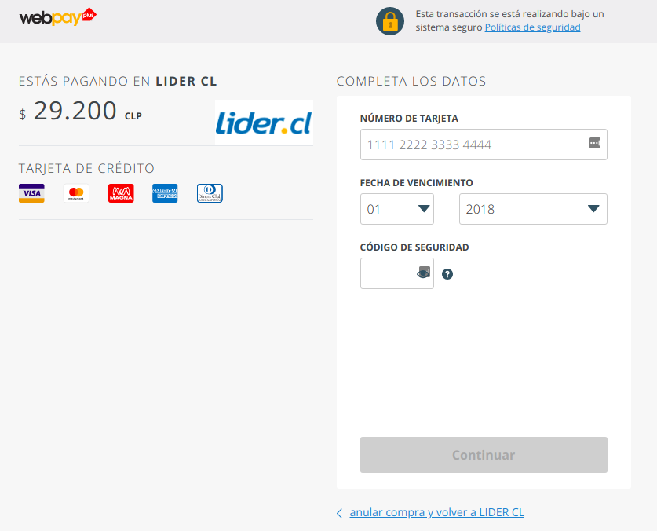
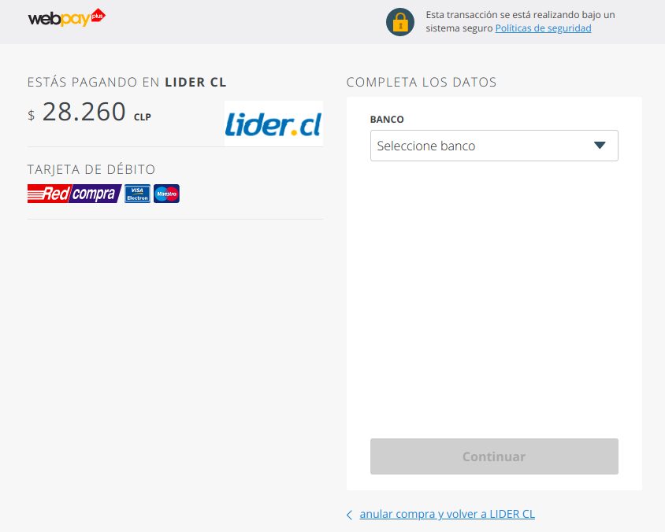
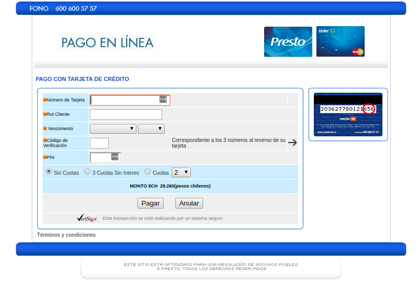

## 3. Mostrar Formulario de Pago Transbank Webpay o Presto

Con la **approval_url** obtenida en el [paso 2](intencion-de-pago-wp.md) puedes desplegar el formulario del medio de pago seleccionado por el cliente.

**Datos de prueba WebPay plus:**

> |Número de Tarjeta|RUT|Password|
> |---|---|---|
> |4051885600446623|11.111.111-1|123|

El cliente debe ingresar los datos de la tarjeta, seleccionar las cuotas y aprobar el pago para que nuestro sistema pueda ejecutar el cargo a la tarjeta de crédito. 

El sistema redireccionará la url de éxito o error, según sea la respuesta recibida en la ejecución del pago.

> **Importante** Las urls anteriormente mencionadas son las que el comercio envió en el [paso 2](intencion-de-pago-wp.md) en los atributos **"redirect_urls.return_url"** y **"redirect_urls.cancel_url"**.

Para finalizar debes consultar el estado de la transacción como se explica a continuación:
[4. Consultar Estado de la Transacción](consulta-de-estado.md)
