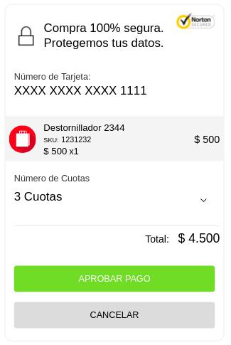

## 5. ¿Cómo realizar el cargo a la tarjeta?

Te ofrecemos dos opciones para realizar el cargo a la tarjeta del cliente, a continuación podrás ver el detalle de cada una: 

### 5.1 Approval

Si quieres utilizar esta opción, necesitas que el cliente apruebe el pago para ejecutar el cargo a la tarjeta de crédito. Para ello debes desplegar la ventana de aprobación del pago a partir de la [approval_url](https://quickpay-connect-checkout.azurewebsites.net/payments/gateways/quickpay/token/0fdcd938-62c7-aab2-5048-c2f172d495ac/pay) obtenida en el [paso 3](#3-mostrar-formulario-de-captura-de-tarjeta).



Si recibes una respuesta con **"state": "paid"** en la URL indicada como **return_url** o consultando desde la **URL self**, entonces el cliente ha aprobado del pago y se ejecuta el cargo a la tajeta de crédito.

  ```
{
    "intent": "sale",
    "additional_attributes": {
        "capture_token": "db95da9e-b94c-0b40-a84b-4268b0ca18bb"
    },
    "application": "28adb999-7a2e-70b8-c092-e4c16a9e9e0a",
    "redirect_urls": {
        "return_url": "https://requestb.in/sfoogtsf",
        "cancel_url": "https://chao.com"
    },
    "transaction": {
        "reference_id": "OD0000233",
        "description": "Transaction detailed description",
        "soft_descriptor": "Short Description",
        "item_list": {
            "shipping_method": "DIGITAL",
            "items": [
                {
                    "sku": "1231232",
                    "name": "Destornillador 2344",
                    "description": "Destornillador SCL - ONT",
                    "quantity": 1,
                    "price": 4500,
                    "tax": 0,
                    "_id": "5a29af7f6867b6000fe42a45"
                }
            ],
            "shipping_address": {
                "line1": "Miraflores 222",
                "city": "Santiago",
                "country_code": "CL",
                "phone": "+56 9 1234 5674",
                "type": "HOME_OR_WORK",
                "recipient_name": "Andres Roa"
            }
        },
        "amount": {
            "currency": "CLP",
            "total": 4500,
            "details": {
                "subtotal": 810,
                "tax": 190,
                "shipping": 0,
                "shipping_discount": 0
            }
        }
    },
    "payer": {
        "payer_info": {
            "documentType": "RUT",
            "documentNumber": "123123123",
            "country": "CL",
            "full_name": "Andres Roa",
            "email": "jlprueba1@quickpay.com"
        },
        "payment_method": "QUICKPAY_TOKEN"
    },
    "links": [],
    "id": "5247451f-e709-bc97-b195-8725f5e5d09a",
    "create_time": "2017-12-07T21:15:43.690Z",
    "update_time": "2017-12-07T21:16:02.340Z",
    "state": "paid",
    "invoice_number": "INPA-50000000915",
    "gateway": {
        "payment_flow": "with_token",
        "installments_number": "1",
        "merchantReferenceCode": "INPA-50000000915",
        "requestID": "5126813618226081704008",
        "decision": "ACCEPT",
        "reasonCode": "100",
        "requestToken": "Ahj7/wSTFezU3sEAuihIilF5MQdkMgKi8mIOyGSYGxlHK2GTSTLdIDgL7QwJyYr2am9ggF0UJAAAjAl3",
        "purchaseTotals": {
            "currency": "CLP"
        },
        "ccAuthReply": {
            "reasonCode": "100",
            "amount": "4500",
            "authorizationCode": "570110",
            "avsCode": "1",
            "authorizedDateTime": "2017-12-07T21:16:02Z",
            "processorResponse": "1",
            "paymentNetworkTransactionID": "111222",
            "ownerMerchantID": "falabella",
            "processorTransactionID": "6073acd1ed184b8cb4a85d8a68d778de"
        },
        "ccCaptureReply": {
            "reasonCode": "100",
            "requestDateTime": "2017-12-07T21:16:02Z",
            "amount": "4500"
        },
        "additionalProcessorResponse": "c7f3fc27-eb83-44f0-8429-5bf6918198a3",
        "capture_token": "db95da9e-b94c-0b40-a84b-4268b0ca18bb",
        "resume": {
            "_id": "5a29af926867b6000fe42a47",
            "card_number": {
                "panLast4": 1111
                "panFirst6": 411111
            },
            "authorizations": {
                "code": "570110"
            },
            "transaction": {
                "type": "CREDIT",
                "date": "2017-12-07T21:16:02.337Z",
                "currency": "CLP",
                "buy_order": "INPA-50000000915",
                "amount": 4500,
                "installments_number": 1
            },
            "response": {
                "code": 100
            }
        }
    }
}
```
Posibles estados de la transacción:
  
| State    | Definición                               |
| -------- | ---------------------------------------- |
| paid  | El cargo fue realizado exitosamente en la cuenta del cliente |
| canceled | El cargo no fue realizado |
| reversed | Tiene al menos una devolución asociada |

### 5.2 Silent Charge

Con esta opción, no es requerida la aprobación del cliente para ejecutar el cargo a la tarjeta de crédito.

Necesitas el **access_token** obtenido en la **Autenticación** y el **id (Token de la tarjeta)** generado en la **Intención de captura**, para ejecutar una llamada a la **API de Silent Charge /silent** de la siguiente forma:

```
 curl -v -X POST 'https://api.sandbox.connect.fif.tech/checkout/payments/gateways/quickpay/token/{Token_de_tarjeta}/silent' \
 -H "Content-Type: application/json" \
 -H "Authorization: Bearer access_token"
```
Obtendras una respuesta similar a:

```
{
    "intent": "sale",
    "additional_attributes": {
        "capture_token": "c9c19a22-b3b9-6b0b-c295-ab41c898f41c"
    },
    "application": "28adb999-7a2e-70b8-c092-e4c16a9e9e0a",
    "redirect_urls": {
        "return_url": "https://requestb.in/sfoogtsf",
        "cancel_url": "https://chao.com"
    },
    "transaction": {
        "reference_id": "OD0000233",
        "description": "Transaction detailed description",
        "soft_descriptor": "Short Description",
        "item_list": {
            "shipping_method": "DIGITAL",
            "items": [
                {
                    "sku": "1231232",
                    "name": "Destornillador 2344",
                    "description": "Destornillador SCL - ONT",
                    "quantity": 1,
                    "price": 4500,
                    "tax": 0,
                    "_id": "5a29b1144bddb8000f673f1a"
                }
            ],
            "shipping_address": {
                "line1": "Miraflores 222",
                "city": "Santiago",
                "country_code": "CL",
                "phone": "+56 9 1234 5674",
                "type": "HOME_OR_WORK",
                "recipient_name": "Andres Roa"
            }
        },
        "amount": {
            "currency": "CLP",
            "total": 4500,
            "details": {
                "subtotal": 810,
                "tax": 190,
                "shipping": 0,
                "shipping_discount": 0
            }
        }
    },
    "payer": {
        "payer_info": {
            "documentType": "RUT",
            "documentNumber": "123123123",
            "country": "CL",
            "full_name": "Andres Roa",
            "email": "jlprueba1@quickpay.com"
        },
        "payment_method": "QUICKPAY_TOKEN"
    },
    "links": [],
    "id": "a8cb0e21-acd1-93d7-f623-9a3a4523a2d0",
    "create_time": "2017-12-07T21:22:28.944Z",
    "update_time": "2017-12-07T21:22:46.142Z",
    "state": "paid",
    "invoice_number": "INPA-50000000916",
    "gateway": {
        "merchantReferenceCode": "INPA-50000000916",
        "requestID": "5126817655686174204009",
        "decision": "ACCEPT",
        "reasonCode": "100",
        "requestToken": "Ahj7/wSTFezjNs1vVeBpilF5MQeDvgKi8mIPB3yYGxlHK2GTSTLdIDgL7QwJyYr2cZtmt6rwNIAAMwWk",
        "purchaseTotals": {
            "currency": "CLP"
        },
        "ccAuthReply": {
            "reasonCode": "100",
            "amount": "4500",
            "authorizationCode": "570110",
            "avsCode": "1",
            "authorizedDateTime": "2017-12-07T21:22:46Z",
            "processorResponse": "1",
            "paymentNetworkTransactionID": "111222",
            "ownerMerchantID": "falabella",
            "processorTransactionID": "0c9a962865c44452a8edef0194cfac5c"
        },
        "ccCaptureReply": {
            "reasonCode": "100",
            "requestDateTime": "2017-12-07T21:22:46Z",
            "amount": "4500"
        },
        "additionalProcessorResponse": "0e372a5c-715c-4a50-b90c-ff774fec23f8",
        "capture_token": "c9c19a22-b3b9-6b0b-c295-ab41c898f41c",
        "resume": {
            "_id": "5a29b1266867b6000fe42a4b",
            "card_number": {
                "panLast4": 1111,
                "panFirst6": 411111
            },
            "authorizations": {
                "code": "570110"
            },
            "transaction": {
                "type": "CREDIT",
                "date": "2017-12-07T21:22:46.141Z",
                "currency": "CLP",
                "buy_order": "INPA-50000000916",
                "amount": 4500,
                "installments_number": 0
            },
            "response": {
                "code": 100
            }
        }
    }
}
```

Posibles estados de la transacción:

| State    | Definición                               |
| -------- | ---------------------------------------- |
| paid  | El cargo fue realizado exitosamente en la cuenta del cliente |
| canceled | El cargo no fue realizado |
| reversed | Tiene al menos una devolución asociada |

Además, agregamos información específica del código entregado por el Gateway CyberSource (Estructura resume del JSON de respuesta). [Ver la lista de códigos de respuesta CyberSource aquí](cybersource_reason_code.md).

Si deseas hacer la devolución al cliente, debes llamar a [API de Anulación](../../anulaciones/introduccion.md).

[Volver al inicio](../introduction.md)
