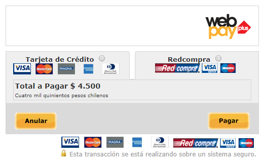

## 3. Mostrar Formulario de Pago Transbank Webpay

Con la **approval_url** obtenida en el [paso 2](intencion-de-pago-wp.md) puedes desplegar el formulario de pago con Transbank Webpay.

**Datos de prueba WebPay plus:**

> |Número de Tarjeta|RUT|Password|
> |---|---|---|
> |4051885600446623|11.111.111-1|123|

Desde este punto, el cliente interactua directamente con WebPay plus. 

Una vez finalizada la transacción, PEINAU devuelve el resultado de esta a la URL que indicaste en el request a la API **intención de pago** [(paso 2)](intencion-de-pago-wp.md).

Ir al paso [4. Consultar Estado de la Transacción](consulta-de-estado.md)
